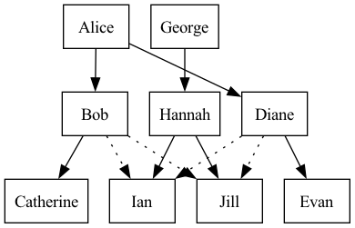

# refab

Use [Fabric](https://github.com/danielmiessler/fabric) commands without a server.

## Usage

You need to set two or three env vars:

`REFAB_FABRIC_PATTERNS_PATH` should point to one or more directories with patterns (as defined by Fabric) in them.  You can point to the `patterns` directory from the Fabric repo (https://github.com/danielmiessler/fabric) and/or your own local copies.

I've included a patterns directory in refab that adds some additional functionality.

`REFAB_OPENAI_API_KEY` should contain your OpenAI API key.

And optioanlly, `REFAB_OPENAI_MODEL` should specify the model to use.  It defaults to `gpt-3.5-turbo-instruct`.

## Examples

    % echo "hello world" | refab ai
    Hello! How can I assist you today?

    % echo "Free disk space" | refab unix                                                                            ✹
    df -h

    % echo "Free disk space" | refab unix| sh                                                                        ✹
    Filesystem                             Size   Used  Avail Capacity iused       ifree %iused  Mounted on
    /dev/disk3s1s1                        3.6Ti   11Gi  1.8Ti     1%  356022  4293652260    0%   /
    ...

    % echo "To optimize SEO, it's crucial to leverage CDN technology and ensure your site's UI/UX is top-notch" | refab dejargonize
    1. SEO: Search Engine Optimization - The practice of enhancing the quality and quantity of website traffic through organic search engine results.
    2. CDN: Content Delivery Network - A system of distributed servers that deliver pages and other web content to a user based on the geographical locations of the user, the origin of the webpage, and the content delivery server, aiming to speed up content loading.
    3. UI/UX: User Interface/User Experience - These terms relate to the design and interface of a website and how user-friendly and pleasing it is to interact with, respectively. UI focuses on the look and layout, while UX deals with the overall experience and ease of use.

    % echo "The patient was admitted with an MI and requires immediate PCI due to significant CAD." | refab dejargonize
    1. MI: Myocardial Infarction - A medical condition commonly known as a heart attack, which occurs when blood flow to the heart is severely reduced or blocked, leading to heart muscle damage.
    2. PCI: Percutaneous Coronary Intervention - A non-surgical procedure used to treat the stenotic (narrowed) coronary arteries of the heart found in coronary artery disease. This procedure involves inflating a balloon and may include placing a stent to keep the artery open.
    3.  CAD: Coronary Artery Disease - A condition characterized by the narrowing of the coronary arteries due to the buildup of plaque, leading to reduced blood flow to the heart muscle.

    % echo "[dog, cat].forEach(speak)" | refab imagine                                                               ✹
    woof
    meow

    % echo "give me some example parents/children/grandparents/aunts/uncles" | refab to_json                         ✹
    {
    "family": {
        "grandparents": [
        {
            "name": "Alice",
            "children": [
            {
                "name": "Bob",
                "children": [
                {
                    "name": "Catherine",
                    "children": []
                }
                ]
            },
            {
                "name": "Diane",
                "children": [
                {
                    "name": "Evan",
                    "children": []
                }
                ]
            }
            ]
        },
        {
            "name": "George",
            "children": [
            {
                "name": "Hannah",
                "children": [
                {
                    "name": "Ian",
                    "children": []
                },
                {
                    "name": "Jill",
                    "children": []
                }
                ]
            }
            ]
        }
        ],
        "aunts": [
        {
            "name": "Diane",
            "niblings": [
            {
                "name": "Ian",
                "parents": ["Hannah"]
            },
            {
                "name": "Jill",
                "parents": ["Hannah"]
            }
            ]
        }
        ],
        "uncles": [
        {
            "name": "Bob",
            "niblings": [
            {
                "name": "Ian",
                "parents": ["Hannah"]
            },
            {
                "name": "Jill",
                "parents": ["Hannah"]
            }
            ]
        }
        ]
    }
    }

    % # This pbpaste is of the above JSON
    % pbpaste | refab to_dot                                                                                         ✹
    digraph G {
    node[shape=box];

    // Grandparents
    "Alice" -> "Bob";
    "Alice" -> "Diane";
    "George" -> "Hannah";

    // Parents to children
    "Bob" -> "Catherine";
    "Diane" -> "Evan";
    "Hannah" -> "Ian";
    "Hannah" -> "Jill";

    // Aunt/Uncle relationships
    "Diane" -> "Ian" [style=dotted];
    "Diane" -> "Jill" [style=dotted];
    "Bob" -> "Ian" [style=dotted];
    "Bob" -> "Jill" [style=dotted];
    }

    % pbpaste | dot -T png -o family.png
    % open family.png

    

